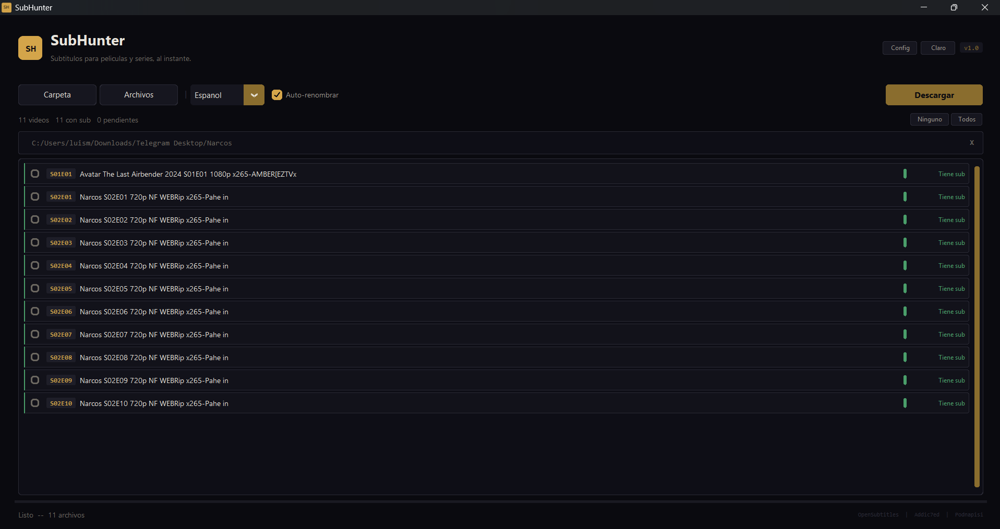

# SubHunter

Automatic subtitle downloader for movies and TV series. Searches multiple providers and matches each subtitle to its video file.

**[Leer en Espanol](README.es.md)**



## Features

- **Smart search** — uses video file hash to find the exact matching subtitle, not just the filename
- **Provider picker** — shows all available subtitles from every provider and lets you choose which one to download
- **Auto-fallback** — if the selected provider fails, automatically tries the next one
- **7 providers** — OpenSubtitles.com, OpenSubtitles.org, Subtitulamos.tv, Addic7ed, Gestdown, Podnapisi, TVSubtitles
- **11 languages** — Spanish, English, Portuguese, French, Italian, German, Chinese, Japanese, Korean, Arabic, Russian
- **Multi-language** — download subtitles in multiple languages in a single pass
- **Auto-rename** — the .srt file is named identically to the video so your player picks it up automatically
- **Additive loading** — add videos from multiple folders without losing the previous ones
- **Duplicate detection** — ignores already loaded files and warns you
- **Right-click menu** — context menu with quick actions (download, find alternative, remove, select, clear)
- **Dark / Light mode** — cinematic dark theme with golden accents, or light mode
- **Persistent config** — remembers language, theme, providers, and credentials between sessions

## Download

### Windows executable (.exe)

Download `SubHunter.exe` from [Releases](https://github.com/Hyzokaaa/SubHunter/releases) and run it directly. No Python required.

### Arch Linux (AUR)

```bash
yay -S subhunter
```

Also available via any other AUR helper (paru, etc.). See the [AUR package page](https://aur.archlinux.org/packages/subhunter).

### From source

```bash
git clone https://github.com/Hyzokaaa/SubHunter.git
cd SubHunter
pip install customtkinter subliminal babelfish
python main.py
```

### Install as package

```bash
git clone https://github.com/Hyzokaaa/SubHunter.git
cd SubHunter
pip install .
```

## Usage

1. Open the app with `python main.py` or the .exe
2. Click **Carpeta** (Folder) or **Archivos** (Files) to load videos
3. Select your language
4. Click **Descargar** (Download)
5. Choose which provider to download from in the picker dialog
6. Subtitles are saved next to each video file

### Settings

Click **Config** (top right) to:

- Set default language
- Enable multi-language download
- Enable/disable providers
- Add OpenSubtitles.com credentials (optional, free account = 20 downloads/day)

## How it works

Unlike simple name-based searches, SubHunter uses [Subliminal](https://github.com/Diaoul/subliminal) to compute a **hash of your video file**. This hash uniquely identifies your exact release, so the subtitle you get is guaranteed to be in sync — no timing issues, no wrong version.

When you click Download:
1. SubHunter scans all enabled providers for subtitles matching your video
2. A **picker dialog** shows you every available option with provider name and match score
3. You choose which one to download (the best match is pre-selected)
4. If the download fails, it **automatically falls back** to the next best option

## Project structure

```
SubHunter/
  main.py                          # Entry point
  subhunter/
    app.py                         # Main window
    core/
      config.py                    # Persistent config (JSON)
      constants.py                 # Extensions, languages, providers
      downloader.py                # Download engine (subliminal)
      theme.py                     # Dark/light themes
    components/
      context_menu.py              # Right-click menu
      glow_bar.py                  # Progress bar with glow effect
      settings_panel.py            # Settings panel
      status_bar.py                # Footer status bar
      subtitle_picker.py           # Provider selection dialog
      toolbar.py                   # Top action bar
      video_list.py                # Scrollable video list
      video_row.py                 # Individual video row
```

## Tech stack

- **Python 3.10+**
- **CustomTkinter** — modern desktop UI
- **Subliminal** — subtitle search engine
- **Babelfish** — language handling

## Contributing

Contributions are welcome. Feel free to open issues or submit pull requests.

## License

[MIT](LICENSE)
